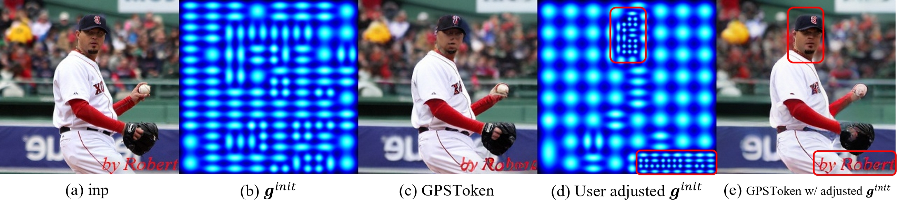

# [GPSToken: Gaussian Parameterized Spatially-adaptive Tokenization Image Representation and Generation](https://arxiv.org/abs/2509.01109)

<a href='https://arxiv.org/abs/2509.01109'></a>
[](LICENSE)
[](https://pytorch.org)

[Zhengqiang Zhang](https://scholar.google.com.hk/citations?hl=zh-CN&user=UX26wSMAAAAJ)<sup>1,2</sup> | [Rongyuan Wu](https://scholar.google.com.hk/citations?hl=zh-CN&user=A-U8zE8AAAAJ)<sup>1,2</sup> | [Lingchen Sun](https://scholar.google.com/citations?hl=zh-CN&tzom=-480&user=ZCDjTn8AAAAJ)<sup>1,2</sup> | [Lei Zhang](https://scholar.google.com.hk/citations?hl=zh-CN&user=tAK5l1IAAAAJ)<sup>1,2,+</sup>

<sup>1</sup> The Hong Kong Polytechnic University  <sup>2</sup> OPPO Research Institute <sup>+</sup> Corresponding Author

---

## 🎯 Motivation: Beyond Fixed Grids
Effective and efficient tokenization is crucial for image representation and generation. Conventional uniform 2D/1D grid tokenization lacks flexibility in handling regions with varying shapes, textures, and locations.
We propose **GPSToken**, a **G**aussian **P**arameterized **S**patially-adaptive **Token**ization framework, enabling non-uniform tokenization via parametric 2D Gaussians. Our method:
- Partitions images into complexity-balanced regions of varying shapes and positions using an entropy-driven algorithm;
- Represents each region as a 2D Gaussian (mean for position, covariance for shape) and texture features;
- Trains a transformer to optimize Gaussian parameters and texture features for content-aware adaptation;
- - Reconstructs the image via a differentiable splatting-based renderer, enabling end-to-end training.


## 🔍 Core Highlights

#### ✅ Spatially-Adaptive Representation
- Iteratively split the image into entropy-balanced regions of varying positions and shapes -- finer partitions in complex textures -- and represent each region with a 2D Gaussian (mean for position, variance for extent) and corresponding texture features.

#### ✅ Dynamic & Scalable  
Furthermore, GPSToken supports:
- **User-Controllable Adjustment**: Manually allocate more tokens to user-interest areas for finer reconstruction.  
- **Variable Token Count**: Increase or decrease token count of each image for better efficiency-fidelity balance.  
- **Scalable to Higher Resolution**: maintain comparable performance at higher resolutions without retraining.

#### ✅ Spatial-Texture Disentanglement
- Each token encodes a **disentangled** representation: Gaussian parameters for spatial geometry and a separate vector for textural features, enabling independent manipulation for downstream tasks like generation.

#### ✅ SOTA Performance
- Achieves **psnr=28.81, ssim=0.809, rFID = 0.22, FID=1.65** on image reconstruction with only **256 tokens**, outperforming prior methods.

## 🎨 GPS-Tokens:  Mathematical Form and CUDA-Based Rendering Algorithm

Each token is represented by a **bounded 2D Gaussian function** and a individual feature, encoding spatial geometry and texture separately.

#### 📐 Standard 2D Gaussian (Unnormalized)

The core form of the $i$-th Gaussian is:


- $(\mu_{x,i}, \mu_{y,i})$: center (position)
- $\sigma_{x,i}, \sigma_{y,i} > 0$: standard deviations (scale)   
- $\rho_i \in [-1, 1]$: correlation coefficient (orientation)

> This is the unnormalized density — avoids costly $Z$ computation.

#### 📏 Bounded Support for Efficiency

To focus on local regions and enable fast GPU rendering, we define the **modified splatting kernel**:


- $s$: spatial support factor (empirically set to $s=5$) 
  → Covers >99.999% of Gaussian mass, negligible truncation error.  

#### 🧩 Token Representation

An image is encoded as $l$ GPS-tokens: $\mathbf{z} = \{\mathbf{z}_1, \dots, \mathbf{z}_l\}$,  where each $\mathbf{z}_i = \\{\mathbf{g}_i, \mathbf{f}_i\\}$ contains:

| Component     | Symbol & Type                     | Role                          |
|---------------|-----------------------------------|-------------------------------|
| **Geometry**  | $\mathbf{g}_i = (\mu_x, \mu_y, \sigma_x, \sigma_y, \rho)$ | Spatial layout (2D Gaussian params)  |
| **Texture**   | $\mathbf{f}_i \in \mathbb{R}^{c-5}$ | Visual features (from CNN/Transformer) |

**Disentangled design**: geometry and texture can be manipulated independently.  


#### ⚡ CUDA-Based Rendering Algorithm
We implement a **CUDA-accelerated rendering algorithm** to parallelize the forward and backward processes of the bounded Gaussian splatting kernel. Implementation details are provided in the `gscuda` folder.

## 🏗️ Framework: From Image to GPS-Tokens

GPSToken pipeline: **Initialization → Refinement → Rendering → Reconstruction**


#### Spatially-adaptive Token Initialization
We use an iterative algorithm to partition the image into regions based on texture complexity. Each region's location and size initialize the Gaussian parameters of corresponding GPS-tokens, enabling a coarse spatially-adaptive representation.

#### Spatially-adaptive Token Refinement
After obtaining the initialized Gaussian parameters, we employ a transformer-based encoder to refine these parameters to achieve fine-grained spatial adaptation, while simultaneously extracting the corresponding texture features $\mathbf{f}$ for each region using RoIAlign layers. After encoder refinement, the parameters better match local textures.

#### End-to-end Reconstruction
During decoding, we first render the GPSTokens into a 2D feature map, then decode them into the reconstructed image. Following existing works, we use a combination of reconstruction loss $L_{\text{rec}}$, perceptual loss $L_{\text{perc}}$, and adversarial loss $L_{\text{adv}}$ during training.


## 📊 Experimental Results

#### 1. Image Reconstruction ($256\times 256$ on Imagenet val set)

GPSToken outperforms fixed-grid methods with same token count.

| Method           | Token Count | Params (M) | PSNR  | SSIM   | LPIPS  | rFID  | FID   |
|------------------|-------------|-----------|-------|--------|--------|-------|-------|
| SDXL-VAE         | 32x32       | 83.6      | 25.55 | 0.727  | 0.066  | 0.73  | 2.35  |
| VAVAE            | 16x16       | 69.8      | 25.76 | 0.742  | 0.050  | 0.27  | 1.74  |
| DCAE             | 8x8         | 323.4     | 23.62 | 0.644  | 0.092  | 0.98  | 2.59  |
| TiTok-B64        | 64          | 204.8     | 17.01 | 0.390  | 0.263  | 1.75  | 2.50  |
| TiTok-S128       | 128         | 83.7      | 17.66 | 0.413  | 0.220  | 1.73  | 3.25  |
| MAETok           | 128         | 173.9     | 23.25 | 0.626  | 0.096  | 0.65  | 2.01  |
| FlexTok          | 256         | 949.7     | 17.69 | 0.475  | 0.257  | 4.02  | 4.88  |
| **GPSToken-S64** | 64          | 127.5     | 22.18 | 0.578  | 0.111  | 1.31  | 3.02  |
| **GPSToken-M128**| 128         | 127.8     | 24.06 | 0.657  | 0.080  | 0.65  | 2.18  |
| **GPSToken-L256**| 256         | 128.7     | 28.81 | 0.809  | 0.043  | 0.22  | 1.65  |

#### 2. Spatial-Adaptivity Visualization
Gaussian tokens automatically concentrate on high-complexity regions.

> *from left to right*: visualization of intialized GS params, visualization of refined GS params, reconstructed imgs, GT imgs.

#### 3. User-Controllable Adaptivity
We can manually guide tokens to focus on user interest regions.

> *from left to right*: input img, visualization of initialized GS params, reconstructed img, visualization of adjusted GS params, reconstructed img using adjusted GS params.

#### 4. Variable Token Count of GPS-Tokens
We can **increase** or **decrease** the count of tokens for encode one image.

> We use GPSToken-M128, which is trained only under 128 tokens, for demonstration.

#### 5. Scales to Higher Resolutions
GPSToken can generalize to higher resolution, e.g., $512\times 512$ or $1024\times 1024$, with models trained only on $256\times 256$.

| Method           | Tokens     | PSNR ↑ | SSIM ↑ | LPIPS ↓ | rFID ↓ | rec. sFID ↓ |
|------------------|------------|--------|--------|---------|------------|-------------|
| **512×512**      |            |        |        |         |            |             |
| SDXL-VAE  | 64×64      | 28.42  | 0.817  | 0.059   | 0.271      | 1.36        |
| VQVAE-f16| 32×32      | 21.83  | 0.604  | 0.172   | 2.29       | 7.95        |
| GPSToken-M128    | 512        | 26.74  | 0.764  | 0.073   | 0.367      | 1.93        |
| GPSToken-L256    | 1024       | 32.00  | 0.887  | 0.039   | 0.175      | 0.699       |
| **1024×1024**    |            |        |        |         |            |             |
| SDXL-VAE   | 128×128    | 33.27  | 0.909  | 0.057   | 0.113      | 0.561       |
| VQVAE-f16 | 64×64      | 25.41  | 0.744  | 0.169   | 1.40       | 4.98        |
| GPSToken-M128    | 2048       | 31.22  | 0.873  | 0.072   | 0.236      | 1.24        |
| GPSToken-L256    | 4096       | 37.71  | 0.955  | 0.031   | 0.055      | 0.276       |

## 🚀 Quick Start
#### Model Zoo

|Models|Token Count|Download|
|---|---|---|
|GPSToken-S64|64|[download](to be continue)|
|GPSToken-M128|128|[download](to be continue)|
|GPSToken-L256|256|[download](to be continue)|

#### Inference scripts
```
python3 inference_gsptoken.py --model_path [model_path] --data_path [data_path] --config configs/gpstoken_l256.yaml --data_size 256 --output [xxx]
```


## CITATION

```
@misc{zhang2025gpstokengaussianparameterizedspatiallyadaptive,
      title={GPSToken: Gaussian Parameterized Spatially-adaptive Tokenization for Image Representation and Generation}, 
      author={Zhengqiang Zhang and Rongyuan Wu and Lingchen Sun and Lei Zhang},
      year={2025},
      eprint={2509.01109},
      archivePrefix={arXiv},
      primaryClass={cs.CV},
      url={https://arxiv.org/abs/2509.01109}, 
}
```

## CONTACT

Please leave a issue or contact zhengqiang with [zhengqiang.zhang@connect.polyu.hk](mailto:zhengqiang.zhang@connect.polyu.hk)


